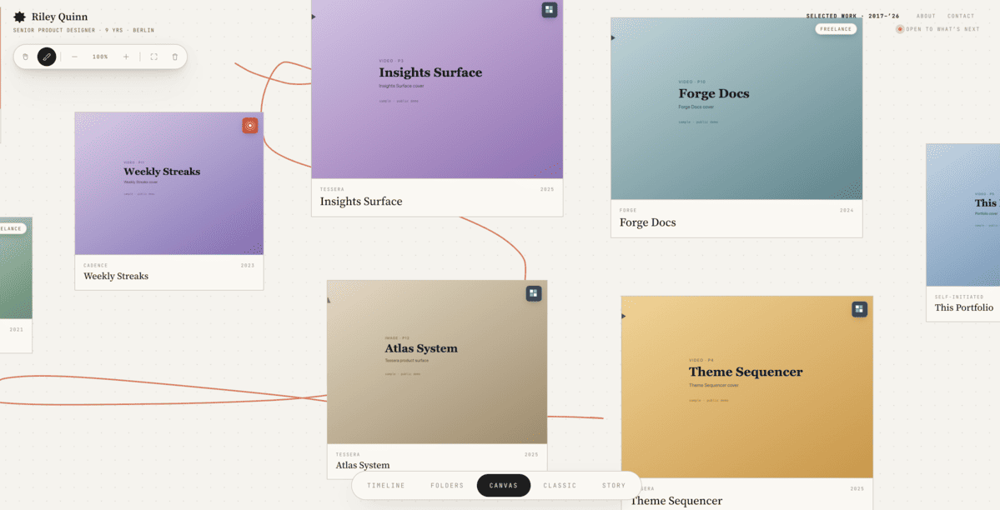

# portfolio-folders

A public demo of one portfolio layout — **Folders** — extracted from a larger multi-view portfolio system. The shell is real; the persona, companies, and case studies are fictional placeholders.



## What this is

This repo shows a single layout: projects grouped by type or by company. About and Contact pages are included; there's no view-switcher and no toggle between layouts. The companion repos cover the other layouts:

- [portfolio-timeline](../portfolio-timeline) — chronological career arc
- [portfolio-folders](../portfolio-folders) — grouped index of projects
- [portfolio-canvas](../portfolio-canvas) — free-roam board with draggable cards

## Use it

1. **Fork or clone.**
2. **Run locally**: `npm run dev` (Python's built-in HTTP server).
3. **Edit the content** in `index.html`:
   - `PERIODS` — career chapters
   - `ALL_PROJECTS` — every project entry
   - `ANCHORS` — transition stories on the timeline
   - The **About** and **Contact** sections are plain HTML inside `index.html`.
4. **Swap in your images** in `assets/<project-id>/`.
5. **Deploy** to anything that serves static files — `vercel.json` is included for SPA-style routing.

## What's in here

```
index.html                  ← Everything (HTML + CSS + JS) in one file
assets/                     ← Per-project SVG placeholders
scripts/gen-placeholders.py ← Regenerates the SVG placeholders
package.json                ← Dev server scripts
vercel.json                 ← SPA rewrite for Vercel
```

No build step, no framework, no dependencies.

## A note on the content

The persona (Riley Quinn), the companies (Drift Labs, Cadence, Forge, Tessera), and every case study in this repo are made up. Replace them with your own. Take it, make it yours, ship it.
